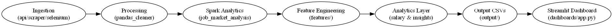

# AI Job Market Intelligence Platform

An end-to-end real-time analytics system that ingests live job postings, processes them using PySpark, and serves insights through an interactive Streamlit dashboard.

---

## 🚀 Key Features

- Real-time multi-source job ingestion
- Incremental data pipeline (bronze storage)
- PySpark analytics processing
- Salary intelligence engine
- Interactive dashboard (Plotly + Streamlit)
- One-command pipeline orchestration
- Docker-ready deployment

---

## 🧱 Architecture



---

## ⚡ Run Pipeline

```bash
python -m pipeline.orchestrator

📊 Run Dashboard
streamlit run dashboards/app.py

🛠 Tech Stack

Python

Pandas

PySpark

Streamlit

Plotly

Docker